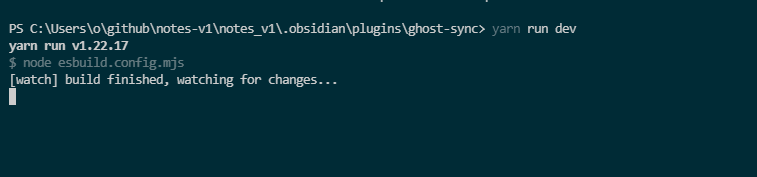

## Ghost Blog Sync

This is a sample plugin for Obsidian (https://obsidian.md).

This project uses Typescript to provide type checking and documentation.
The repo depends on the latest plugin API (obsidian.d.ts) in Typescript Definition format, which contains TSDoc comments describing what it does.

**Note:** The Obsidian API is still in early alpha and is subject to change at any time!

This sample plugin demonstrates some of the basic functionality the plugin API can do.
- Changes the default font color to red using `styles.css`.
- Adds a ribbon icon, which shows a Notice when clicked.
- Adds a command "Open Sample Modal" which opens a Modal.
- Adds a plugin setting tab to the settings page.
- Registers a global click event and output 'click' to the console.
- Registers a global interval which logs 'setInterval' to the console.

### First time developing plugins?

Quick starting guide for new plugin devs:

- Make a copy of this repo as a template with the "Use this template" button (login to GitHub if you don't see it).
- Clone your repo to a local development folder. For convenience, you can place this folder in your `.obsidian/plugins/your-plugin-name` folder.
- Install NodeJS, then run `yarn` in the command line under your repo folder.
- Run `yarn run dev` to compile your plugin from `main.ts` to `main.js`.
- Make changes to `main.ts` (or create new `.ts` files). Those changes should be automatically compiled into `main.js`.
- Reload Obsidian to load the new version of your plugin.
- Enable plugin in settings window.
- For updates to the Obsidian API run `yarn update` in the command line under your repo folder.

# Development
```sh 
cd /path/to/obsidian/vault/.obsidian/plugins/
git clone 
yarn 
yarn run dev


npm install -g nodemon
nodemon ./SyncService.js

```


### Releasing new releases

- Update your `manifest.json` with your new version number, such as `1.0.1`, and the minimum Obsidian version required for your latest release.
- Update your `versions.json` file with `"new-plugin-version": "minimum-obsidian-version"` so older versions of Obsidian can download an older version of your plugin that's compatible.
- Create new GitHub release using your new version number as the "Tag version". Use the exact version number, don't include a prefix `v`. See here for an example: https://github.com/obsidianmd/obsidian-sample-plugin/releases
- Upload the files `manifest.json`, `main.js`, `styles.css` as binary attachments. Note: The manifest.json file must be in two places, first the root path of your repository and also in the release.
- Publish the release.

### Adding your plugin to the community plugin list

- Publish an initial version.
- Make sure you have a `README.md` file in the root of your repo.
- Make a pull request at https://github.com/obsidianmd/obsidian-releases to add your plugin.

### How to use

- Clone this repo.
- `yarn` to install dependencies
- `yarn run dev` to start compilation in watch mode.

### Manually installing the plugin

- Copy over `main.js`, `styles.css`, `manifest.json` to your vault `VaultFolder/.obsidian/plugins/your-plugin-id/`.

### Improve code quality with eslint (optional)
- [ESLint](https://eslint.org/) is a tool that analyzes your code to quickly find problems. You can run ESLint against your plugin to find common bugs and ways to improve your code. 
- To use eslint with this project, make sure to install eslint from terminal:
  - `yarn global add eslint`
- To use eslint to analyze this project use this command:
  - `eslint main.ts`
  - eslint will then create a report with suggestions for code improvement by file and line number.
- If your source code is in a folder, such as `src`, you can use eslint with this command to analyze all files in that folder:
  - `eslint .\src\`


# Links
### [mixmark-io/turndown: 🛏 An HTML to Markdown converter written in JavaScript](https://github.com/mixmark-io/turndown)
### 
### https://medium.com/javascript-scene/reduce-composing-software-fe22f0c39a1d
### https://www.freecodecamp.org/news/pipe-and-compose-in-javascript-5b04004ac937/

 

### API Documentation

See https://github.com/obsidianmd/obsidian-api
