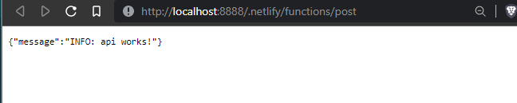
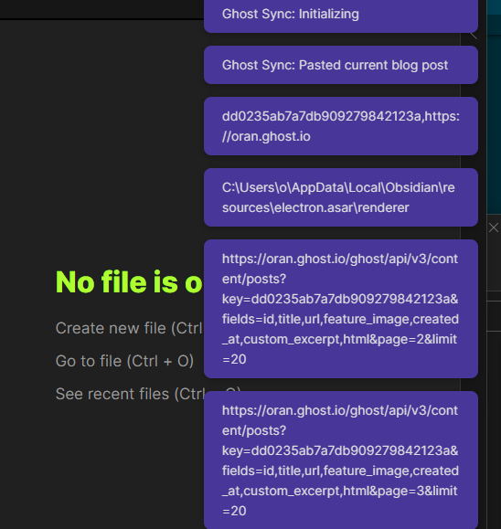

## Ghost Blog Sync

This is a plugin for Obsidian (https://obsidian.md).

# Development
```sh 
cd /path/to/obsidian/vault/.obsidian/plugins/
git clone 
yarn 
yarn run dev


npm install -g nodemon
nodemon ./SyncService.js

```


### How to use
```bash
git clone https://github.com/wisehackermonkey/ghost-sync.git
copy "ghost-sync" to vault location within path/to/vault/.obsidian/plugins

open shell to 
cd ghost-sync
yarn 
yarn run dev
```
### open obsidian and look for the  `ghost sync` plubin under community
### NOte: please enable community plugnis they call ti "safemode" => off
 

# netlify api entpoints
`https://ghostsync.netlify.app/.netlify/functions/post`
or
`https://ghostsync.netlify.app/api/v1/post`
# run netlify function (api endpoint) locally with netlify-cli
```bash
netlify dev
```
### open browser to 
`http://localhost:8888/.netlify/functions/post`

### example requiest
`http://localhost:8888/.netlify/functions/post?ghostAdminApiKey=24324324234`



# Links
### [mixmark-io/turndown: 🛏 An HTML to Markdown converter written in JavaScript](https://github.com/mixmark-io/turndown)
### [pjeby/hot-reload: Automatically reload Obsidian plugins in development when their files are changed](https://github.com/pjeby/hot-reload)
### https://medium.com/javascript-scene/reduce-composing-software-fe22f0c39a1d
### https://www.freecodecamp.org/news/pipe-and-compose-in-javascript-5b04004ac937/
### [create a flie |Vault | Obsidian Plugin Developer Docs](https://marcus.se.net/obsidian-plugin-docs/api/classes/Vault)
### [Ghost Admin API Documentation](https://ghost.org/docs/admin-api/)
### [kmaasrud/awesome-obsidian: 🕶️ Awesome stuff for Obsidian](https://github.com/kmaasrud/awesome-obsidian#for-developers)
### [https://www.json2yaml.com](https://www.json2yaml.com/)
 

### API Documentation

See https://github.com/obsidianmd/obsidian-api


# work flow


<!-- 


### Releasing new releases

- Update your `manifest.json` with your new version number, such as `1.0.1`, and the minimum Obsidian version required for your latest release.
- Update your `versions.json` file with `"new-plugin-version": "minimum-obsidian-version"` so older versions of Obsidian can download an older version of your plugin that's compatible.
- Create new GitHub release using your new version number as the "Tag version". Use the exact version number, don't include a prefix `v`. See here for an example: https://github.com/obsidianmd/obsidian-sample-plugin/releases
- Upload the files `manifest.json`, `main.js`, `styles.css` as binary attachments. Note: The manifest.json file must be in two places, first the root path of your repository and also in the release.
- Publish the release.

### Adding your plugin to the community plugin list

- Publish an initial version.
- Make sure you have a `README.md` file in the root of your repo.
- Make a pull request at https://github.com/obsidianmd/obsidian-releases to add your plugin.


### Improve code quality with eslint (optional)
- [ESLint](https://eslint.org/) is a tool that analyzes your code to quickly find problems. You can run ESLint against your plugin to find common bugs and ways to improve your code. 
- To use eslint with this project, make sure to install eslint from terminal:
  - `yarn global add eslint`
- To use eslint to analyze this project use this command:
  - `eslint main.ts`
  - eslint will then create a report with suggestions for code improvement by file and line number.
- If your source code is in a folder, such as `src`, you can use eslint with this command to analyze all files in that folder:
  - `eslint .\src\` -->

